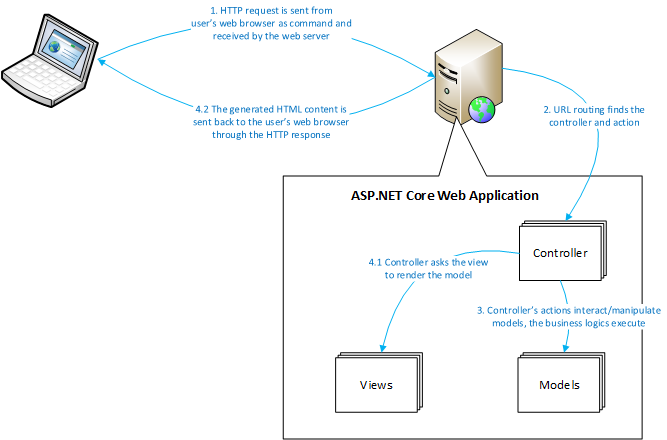

# In The Name Of Allah
---
## The Paradigms of Web Development
---
- There are two popular paradigms of web development, the __dynamic web page__ and __web client + web service__. Both of them are deeply impacted by the __MVC pattern__. Let's take a look.

> ### __Dynamic Web page__

- The dynamic web page paradigm is __web browser oriented__. That means the user must use the __web browser__ to access a dynamic web page based, web application (usually we call this a __website__).
- The web application is deployed on a __web server__.
- When the user's web browser accesses the web application, the network stream between the web browser and the web server is essentially HTML content (web pages). Since the HTML content (web pages) is dynamically generated by the web server, based on the inputs and operations from the users, we call it dynamic web page technology.

#### Based on how the application generates the HTML content, we can divide the dynamic web page paradigm to three generations:

 > __CGI generation (198x~199x)__:
  -  You can imagine the __Common Gateway Interface (CGI)__ application is just a __console application__ running on the web server.
  - It keeps listening to the HTTP requests that come from the users' web browser, extracts the inputs, executes the calculation and wraps the execution results in HTML tags such as <'input'>, <'form'>. Usually, CGI applications are written in pure programming languages such as C and C++.
  - The feeling of writing CGI applications is akin to painting a picture in a dark room; you cannot turn on the light until you finish it.

> __Server page generation (199x~200x)__:
-  The name server (generated) page is used to distinguish from the static page.
- __Static page__ means the HTML pages (.html files) exist on the web server statically, before the users' request for them, and the content in the HTML pages won't change and won't be impacted by the users' requests.
- What makes the previously mentioned CGI development inefficient, is the business logic.
-  Developers must be good at both business logic programming and HTML, so they can wrap the computation result into the proper HTML structure.
- ###### And don't forget, all these are without visualization, which makes the CGI application hard to test.
- To eliminate the flaws of the CGI, server pages adopted the idea of RAD and introduced the concept of a page template.
- __A page template__ file is not an HTML file, but its skeleton with most of the content as HTML tags.
-  In the template, there are some reserved __“holes”__ for the placing the computation results.
-  Eventually the web application will patch these "holes" in the template with the computation result and generate the final HTML content.
- __We call this render the server page.__
-  In short, server pages are not truly HTML pages, they are HTML page templates.
-  The server page technology separates the HTML related code from the business logic code, makes the page template design in a What You See IS What You Get (WYSIWYG) mode, which improves the development performance.
- __ASP, ASP.NET, JSP, PHP, and Ruby on Rails , django ,flask python, Laravel  PHP__ are masterpieces of this generation.

> __MVC based web application:__
-  Since server pages are an event-driven RAD technology, it inherits the flaws of event-driven development - most of the code is written in event handlers.
- It's easy to grow the web application quickly but hard to maintain well.
- So developers transformed the web application framework using the MVC pattern.
-  The server pages become views.
-  Logic and data are encapsulated into controllers and models.
-  Thus the MVC based web application is neat, robust, extensible, and easy to maintain.
-  Transformed by the MVC pattern, the new generation of ASP.NET is called ASP.NET MVC.

- You may notice that there are some scattered details of MVC web applications that confuse new developers, let's take a look:
 - Where is ASP.NET MVC 5:
   - The official version of ASP.NET MVC stops at 4, where is ASP.NET MVC 5? The truth is that version 4.x of ASP.NET MVC is built on the .NET Framework, which can only be deployed on the Windows platform while the latest version of ASP.NET MVC is built on .NET Core, which is a cross-platform framework. Thus the latest version of ASP.NET MVC is called ASP.NET Core.
   - In the future, the version of ASP.NET Core will grow with the version of the .NET Core framework. ASP.NET Core represents the future of the ASP.NET MVC, and this course is focused on designing MVC with ASP.NET Core.
 -
 - __Server-side MVC:__
   - Web applications run on servers, so we call the MVC pattern which is applied to the web application server-side MVC.

- __Architectural level:__
  - For an MVC-based web application, the MVC pattern is applied on the architecture-level which means the MVC pattern separates the whole web application into models, views, and controllers.
  - Therefore, in this course, we consider that MVC is an architectural pattern.

- View is not UI: In the original idea of the MVC pattern, views are the UI's interface with users. But for MVC web applications, the views which evolve from the server pages are actually HTML page templates. That means, to get a truly UI (the HTML content) we must render the view.

> ### Web Client + Web Service
 - Compared to a dynamic web page, the idea of a web service is to send the “naked” computation result to the web client and to not wrap the result in HTML tags.
 - Thus the web service does __not__ need to __render the views__ and generate the HTML content.
 - The web client decides what to do with the result.

 > The are many different varieties of web clients:
 - mobile apps (such as iOS apps, Android apps, Windows Phone apps)
desktop applications
 - Single (HTML) Page Applications (SPA)

In this paradigm, the MVC pattern impacts both the web service and the web client.

- When the MVC pattern is applied to the web services, it's also a server-side and architecture-level pattern, which is similar to the MVC pattern applied to the web applications.
- The difference is, you will see controllers and models only in a web service project.
-  That's because a web service doesn't have a UI.
- If you are interested in learning how to create MVC based web services, please check the course Build Web APIs using ASP.NET.

> When the MVC pattern is applied on a web client, it is a client-side and page/component level pattern. Below are some examples,

 - __Mobile apps:__ the view is an iOS app page, the model is the data from the web service, the controller is an instance of a __Swift/Objective-C class__

- __SPA__: the view is an __HTML page__, the model is a JavaScript object that holds the data from the web service, and the __controller is also a JavaScript object__

- __Desktop application:__ the view is an instance of a UI component (form, window, page, user control, etc.), while the model and controller are class instances

> The Execution Cycle of ASP.NET Core Web Application
To be a good ASP.NET Core developer you need to understand its execution cycle.

> It's critical for you to design, develop and debug a high-quality web application.

 > ## ASP.NET Core has four steps in a cycle of execution:

- __Receive a Command:__ the command is an HTTP request sent by a web browser.
-  The HTTP request can be launched by an __input in the address bar__, by clicking a hyperlink, or by __submitting a form__, etc.
-  Each HTTP request carries the message of the user's intention and will be handled by the __web server__ on which the ASP.NET Core application is hosted.
- __URL Routing:__ each HTTP request contains a URL, and this URL indicates which application, which controller, and which action will process the command.
- If the URL routing doesn't find a matching destination, a __404 Not Found HTTP response__ will be sent back.
- __Action Execution:__ once the command is routed to its destination action (a method of the controller class), the action will extract the information and data from the HTTP request and begin to process it.
- If needed, models will be involved in this step.
- __View Rendering:__ the action in the controller triggers the view engine to render the specific view (a __.cshtml file__).
- The view engine, called __Razor__, will generate the final HTML content and that content will be sent back to the user's web browser through the HTTP response.
- The action may pass a model object to the view, if so, and based on the rendering logic, the data carried by the model object will be woven into the HTML content and shown in the user's web browser.
- 
