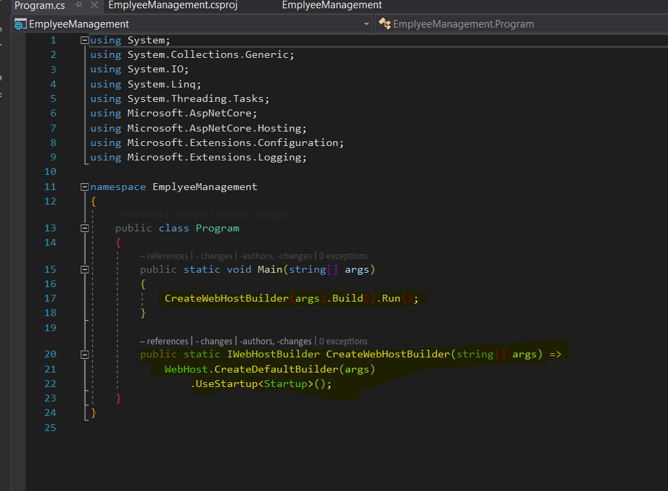
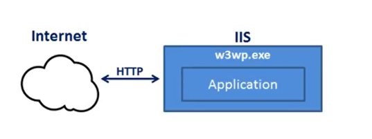
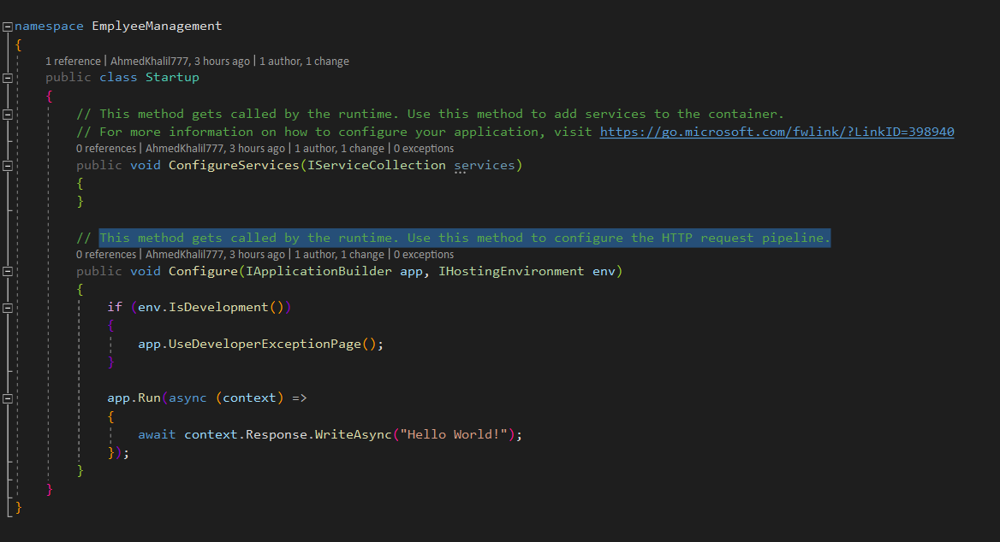
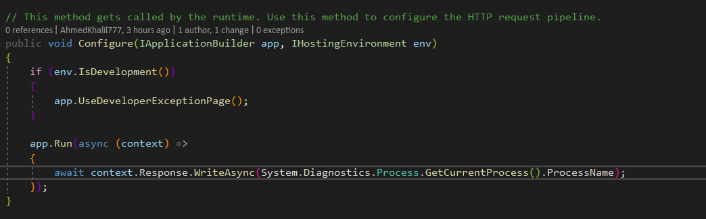
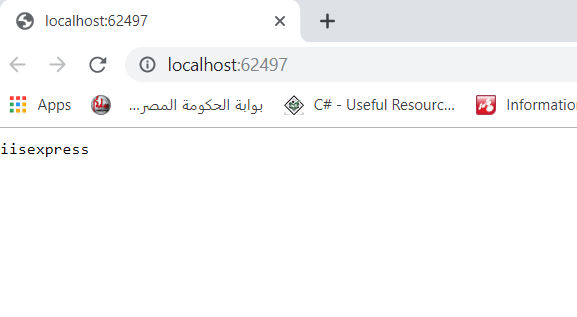
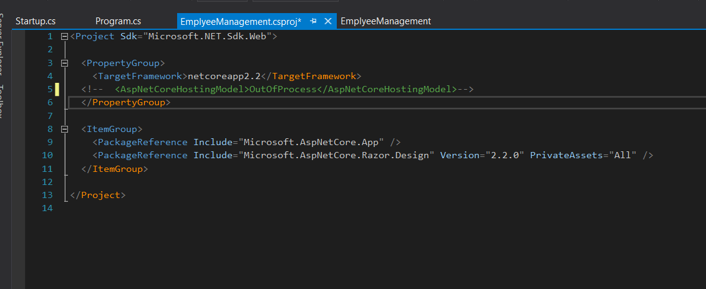
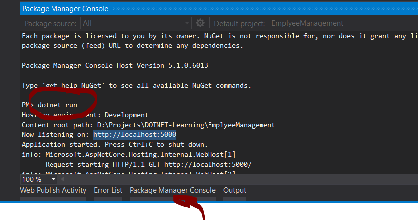
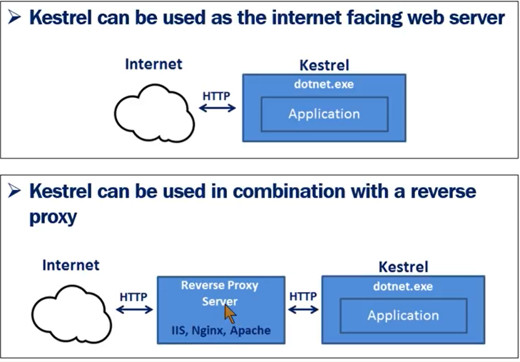
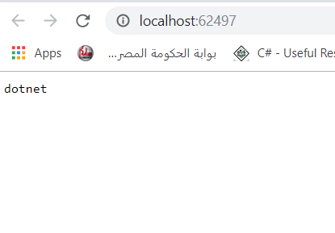
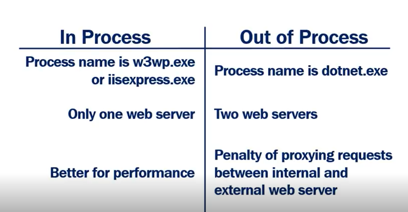

# ASP.net Core
 > Cross Platform , High performance , open source , for building new Cloud based , Internet connected Applications.

 > is the redesign of the __framework(4.x)__
 ## New Features :
 - __Cross Platform__ can run on any os __(windows / Linux / Mac)__ and run on any server __(Docker - IIS - Apache - or on your process)__.

 - Building support for __Dependincy Injection__ Design Pattern
 - __one programming model__ / (API , MVC) All Controllers return the same type of object __IActionResult__ as JsonResult and ViewResult inhirit from it.
 - __Testability__ Easily , Enjoyable Experience =>  support __Unit testing__ . 
 - __Open Source__ and __Community focus__ Better/Security Support.
 - __Modulariity__ with __middleware__ Components => Both __Request and the Response__ are composed by middleware components
   - Rich set of built in middleware components are provided out of the box .
   - you can create your __custom Middleware__.
 - __file and refrances__ are not included to the project file 
    - that makes if you need to add new Elementit will be included Autamitically on the proj file => The file system choose which file will be contained in a proj . 
    - that means if you add any item from other services (Windows Explorer New File ) => it will be reflected to the proj.
 ---

## To develop a code and  run App 
  - You wanna IDE (VS, VS code , sublime , Atom , .....)
  - Dotner Core sdk from microsoft (dot.net). 
---
## Creating New App :
 - there are many template to use (web forms , mvc , Api , Empty , Angular , Redux , ....)
 - File > new > project > Choose dotnet core App web 
 - then choose any template you want but in this we gonna choose the __empty__
 - The MVC Template has a  lot of contents __*(Js - CSS - Bootstrap + Jquery + Model + View + Conterollers).*__
 - __API__ is empty from Views so no UI Libraries .
 - __Empty template__ can be transformed to any  template just develop the pipelines .
 - __Web App__ template uses the new __Razor pages of dotnet__
 ---
 ## project file modification (Instructions)
 - project modification on Csproj file in MVC framework must first => Unload project then modify  the load
- project modification on Csproj file in MVC Core you need not to unload proj (Vbproj --  CSProj)
---
## Let's now take a look in Csproj file and What it contains: 
 
 - TargetFramework specifies for application we Use Target Framework Moniker (TFK) is here (net coreapp2.2).

 |Name| Appriviation|TFM|
 |--|--|--|
 |.net framework| net | net 451 , net472|
 |.net core 2| netcoreapp | net coreapp2.2 , net coreapp1.0|
 - __AspNetCoreHostingModel__ Spcify the application How can be Hosted.
   - __Inprocess__ and __Outofprocess__ 
     - __Inprocess__ hosts the app inside the IIS *(worker process w3wp.exe)*
     - __OutOfprocess__ hosting model forward web requests to the backend web Asp.net app running the __kestrel server__ 
     - the Default is the OutofProcess
 - __PackageReferance__ used to Include Nuget package that is installed for application
   - MetaPackage __(Microsoft.AspNetCore.App)__
   - Metapackage Have no content on its own
   - it just contain a list of Dependancies
   - there are a version number and if the the version is not edited => implicitly version specified by the sdk
   - Microsoft Support not editing it (rely)
---
## Main Function 


 - ### Why in Asp.net core there are main method :
   - Asp.net core start as a console app ,so we have main method
   - the entry point of the web app and make it web app
   ---
 - The Main Function Has a line of code 
  ```
          public static void Main(string[] args)
        {
            CreateWebHostBuilder(args).Build().Run();
        }
  ```
 -  the createwebhosbuilder method call createdefaultbuilder that create the configuration of web host application and then complet __the specified configuration from Startup Class__


## StartUp class have 2 methods :

 - __ConfigureServices__ 
   - This method gets called by the runtime.
   - Use this method to add services to the __container__.
 - __Configure__
   - This method gets called by the runtime. 
   - Use this method to configure the HTTP request pipeline.
---
## In Process Hosting :
 ### some of the CreateDefaultBuilder() Tasks : 
  - Setting Up the web server 
  - loading the host and application configuration from different sources
  - Configuring Logging
 ### InProcess Uses the CreateDefaultBuilder()
 -  to use function UseIIS() Behind the scene of Worker process(w3wp.exe or IIS express.exe).
 - Inprocess hosting has throughputs higher than outofProcess model
 - There are one server to run the app
 

 ### lets now use our web app to show what is the process running to run app 
  - go to startup class 
  
  - in Run Method we gonna change the query to the Current process name
  
  - Then Run ... Its IISexpress
  
---
 ## OutOF Process Has 2 Servers 
  - Internal web server __Kestrel__
  - External web server __IIS , Nginx , Apache__
 > If you need to change to  out of Process 
   - delete the Aspnetcorehosting Model Item from CSPROJ
   - or Change its value to OutOfProcess
   

---
 ## What is Kestrel 
  - A cross-Platform web server for running  Asp.net core
  - Can be used by itself , as an edge server
  - the process used to run application is called __dotnet.exe__
  - Using the dotnet process by (CLI or PowerShell or any another Command support ) in the same proj Directory
  
  
  
  - and if it's Inprocess and run the app from CLI the Server will be Kestrel (OutOfProcess)
---
