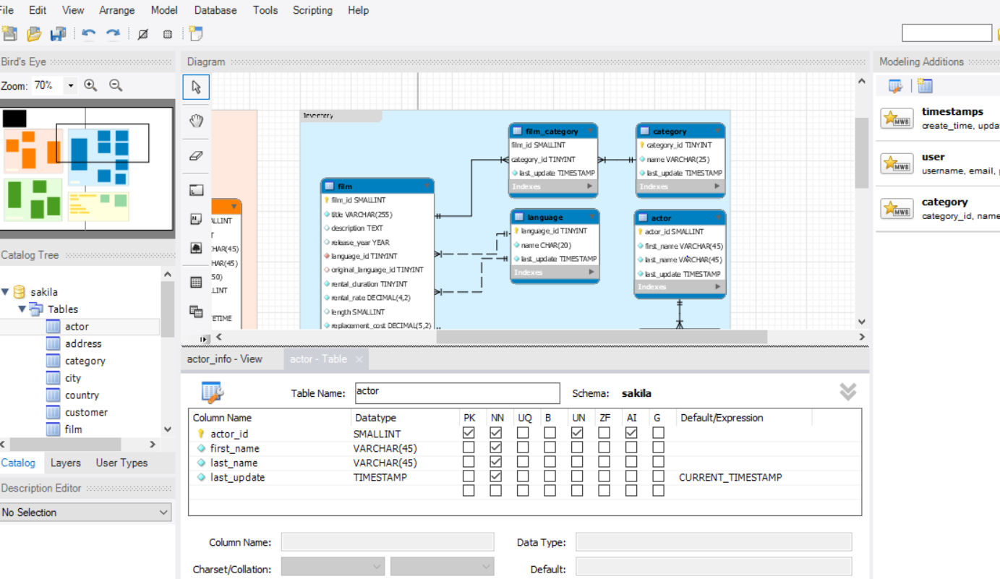

# In The Name OF ALLAH
---
## Advanced Design Principles and Design Patterns
#### Lesson Introduction
---
- As we've seen before, the __domain models__ are just __POCO__ classes involved in the __business logic__ of an application.
-  Console application, mobile application, web application - all kinds of well-designed applications have their domain models.
-  Therefore the principles and skills of creating domain models are universal.
---
## Basic Design Principles
- Throughout this course we use C#, and we know C# is an object-oriented (OO) programming language.

- As an experienced C# developer you may have heard of the SOLID principles, the “common sense” of object-oriented design (OOD).
- To design a good domain model, we should follow the SOLID principles but also moderately accommodate to particular cases of the business logic when necessary.

- The table below is a summary of the SOLID principles.
-  You can find more details of these principles on [Wikipedia](https://en.wikipedia.org/wiki/SOLID_(object-oriented_design).
-  Also, I strongly recommend the book Agile Principles, Patterns, and Practices in C# for further reading on the topic.

|Initial|	Principle|	Concept|
|:--:|:----:|:---:|
|S|	Single responsibility principle (SRP)|	a class should have only a single responsibility (i.e., only one potential change in the software's specification should be able to affect the specification of the class)|
|O|	Open/closed principle (OCP)|	“software entities … should be open for extension, but closed for modification.”|
|L|	Liskov substitution principle (LSP)	|“objects in a program should be replaceable with instances of their subtypes without altering the correctness of that program.” See also design by contract.|
|I|	Interface segregation principle (ISP)|	“many client-specific interfaces are better than one general-purpose interface.”
|D|	Dependency inversion principle (DIP)	|one should “depend upon abstractions, [not] concretions.”|

---
## __Advanced Design Principles and Design Patterns__
- When abstracting data from the real world and encapsulating it to domain models, the relationships between domain models reflect the relationships between the real-world objects.
- Some of these relationships are clear, fixed, and universal.
-  For example, a subordinate of a manager can also be a manager, and a child item in a folder can also be a folder.
-  For both of them, we can design an interface as:
```
public interface IComponent {
    int ID { get; set; }
    string Name { get; set; }
    IComponent Parent { get; set; }
    ICollection<IComponent> Children { get; set; }
}
```
- This kind of relationship will hold a group of objects together and generate a data structure, which we call a design pattern.

-  Teaching design patterns is beyond this course, but if you want to learn more about design pattern, the website __DoFactory__ is a very good resource.
- You can find the definition of all 23 classical design patterns and their C# implementations on this website.

- Also please remember, design patterns are based on SOLID principles.
- If you abstract the business logic and create domain models follow the SOLID principles, the design patterns will emerge themselves.

---
#### Map Domain Model to Data Table
---
- Another source of domain models is a database.
-  Usually, the database is a well-designed schema which reflects the relationships between business entities precisely.

-  Since we installed the MySQL database management system and its sample databases, let's use the sakila database as the example in this walk through.

- Start the MySQL Workbench, on the left of the window find the Navigator panel.
-  Under the SCHEMAS panel, expand the sakila database and its tables tree node.
- Right click the actor table, then click the Table Inspector item in the context menu, you will see the information for the actor table.
- Click the Columns tab, you will get the same view as the screenshot below:
- 
- There are two groups of useful information for us to translate a table schema to a model class:

- The detailed information in the Columns tab of Table Inspector panel.
- The brief information in the Information panel.
- From these two panels we can get the information below:

- The actor table has four columns, they are __actor_id, first_name, last_name and last_update__

- The MySQL data types of these columns are __smallint(5) unsigned, varchar(45), varchar(45) and timestamp__
- The  __actor_id is the primary key (PK)__ of the table, and the value of last_update column will be generated by a trigger

- Based on this information, we can create the model class as below:
```
public partial class Actor {
    public int Actor_ID { get; set; }
    public string First_Name { get; set; }
    public string Last_Name { get; set; }
    public DateTime Last_Update { get; set; }
}
```
- Why do we create the domain model class like this? Let's have a closer look at why in the next topic, Domain Model as Entity.
>### __Domain Model as Entity__

- Most of the web application frameworks will use an __Object-Relational Mapping (ORM)__ framework to map the domain model class to the database table.
- The benefit of using ORM frameworks is that the __“business logic layer developer”__ can operate the database without mixing SQL statements in their C# code.
- The ORM framework can translate the data, __create/read/update/delete (CRUD) operations__ into SQL statements, or wrap stored procedures in class methods.

- __Entity Framework Core (EF Core)__ is the suitable ORM framework for ASP.NET Core.
- To use EF Core in the project, we need to add the NuGet packages. After adding the EF Core references to the project, we can modify our domain model class with EF Core attributes and make it an entity class.

- After the modification, the model/entity class will look like:
```
public partial class Actor {
    [Key]
    public int Actor_ID { get; set; }
    public string First_Name { get; set; }
    public string Last_Name { get; set; }
    public DateTime Last_Update { get; set; }
}
```
- Or, we can go further and remove the underscore from the property names:
```
[Table("actor")]
public partial class Actor {
    [Key, Column("actor_id")]
    public int ActorID { get; set; }

    [Column("first_name")]
    public string FirstName { get; set; }

    [Column("last_name")]
    public string LastName { get; set; }

    [Column("last_update")]
    public DateTime LastUpdate { get; set; }
}
```
- Use Partial Class to Separate Data and Operation
- You may also notice that we created the model class as a partial class.
- That's because we should separate the operation/behavior portion from the data/entity portion.
- The benefit of doing this is that you can generate the data/entity portion of the model class using automation tools without overriding or removing the operation/behavior code.
- For example, the code below won't be overridden when you regenerate the entity portion of the Actor class:
```
public partial class Actor {
    public IList<Film> GetFilmsInStock() {
        // call stored procedures
    }

    public IList<Film> GetFilmsNotInStock() {
        // call stored procedures
    }
}
```
<table>
<thead>
<tr>
<th style="text-align: left;">MySQL Type Name</th>
<th style="text-align: left;">Return value of&nbsp;GetColumnClassName</th>
<th style="text-align: left;">.NET Framework Type</th>
</tr>
</thead>
<tbody>
<tr>
<td style="text-align: left;">BIT(1)</td>
<td style="text-align: left;">BIT</td>
<td style="text-align: left;">bool/System.Boolean</td>
</tr>
<tr>
<td style="text-align: left;">BIT(&gt;1)</td>
<td style="text-align: left;">BIT</td>
<td style="text-align: left;">byte[]</td>
</tr>
<tr>
<td style="text-align: left;">TINYINT</td>
<td style="text-align: left;">TINYINT</td>
<td style="text-align: left;">bool/System.Boolean&nbsp;if the configuration property&nbsp;tinyInt1isBit&nbsp;is set to&nbsp;true&nbsp;(the default) and the storage size is 1, or&nbsp;int/System.Int32&nbsp;if not.</td>
</tr>
<tr>
<td style="text-align: left;">BOOL,&nbsp;BOOLEAN</td>
<td style="text-align: left;">TINYINT</td>
<td style="text-align: left;">See&nbsp;TINYINT, above as these are aliases for&nbsp;TINYINT(1), currently.</td>
</tr>
<tr>
<td style="text-align: left;">SMALLINT[(M)] [UNSIGNED]</td>
<td style="text-align: left;">SMALLINT [UNSIGNED]</td>
<td style="text-align: left;">int/System.Int32&nbsp;(uint/System.UInt32 if it is&nbsp;UNSIGNED)</td>
</tr>
<tr>
<td style="text-align: left;">MEDIUMINT[(M)] [UNSIGNED]</td>
<td style="text-align: left;">MEDIUMINT [UNSIGNED]</td>
<td style="text-align: left;">int/System.Int32&nbsp;(uint/System.UInt32 if it is&nbsp;UNSIGNED)</td>
</tr>
<tr>
<td style="text-align: left;">INT,INTEGER[(M)] [UNSIGNED]</td>
<td style="text-align: left;">INTEGER [UNSIGNED]</td>
<td style="text-align: left;">int/System.Int32, if&nbsp;UNSIGNED&nbsp;System.UInt32</td>
</tr>
<tr>
<td style="text-align: left;">BIGINT[(M)] [UNSIGNED]</td>
<td style="text-align: left;">BIGINT [UNSIGNED]</td>
<td style="text-align: left;">long/System.Int64, if UNSIGNED&nbsp;ulong/System.UInt64</td>
</tr>
<tr>
<td style="text-align: left;">FLOAT[(M,D)]</td>
<td style="text-align: left;">FLOAT</td>
<td style="text-align: left;">float/System.Single</td>
</tr>
<tr>
<td style="text-align: left;">DOUBLE[(M,B)]</td>
<td style="text-align: left;">DOUBLE</td>
<td style="text-align: left;">double/System.Double</td>
</tr>
<tr>
<td style="text-align: left;">DECIMAL[(M[,D])]</td>
<td style="text-align: left;">DECIMAL</td>
<td style="text-align: left;">decimal</td>
</tr>
<tr>
<td style="text-align: left;">DATE</td>
<td style="text-align: left;">DATE</td>
<td style="text-align: left;">System.DateTime</td>
</tr>
<tr>
<td style="text-align: left;">DATETIME</td>
<td style="text-align: left;">DATETIME</td>
<td style="text-align: left;">System.DateTime</td>
</tr>
<tr>
<td style="text-align: left;">TIMESTAMP[(M)]</td>
<td style="text-align: left;">TIMESTAMP</td>
<td style="text-align: left;">System.DateTime</td>
</tr>
<tr>
<td style="text-align: left;">TIME</td>
<td style="text-align: left;">TIME</td>
<td style="text-align: left;">System.DateTime</td>
</tr>
<tr>
<td style="text-align: left;">YEAR[(2 | 4)]</td>
<td style="text-align: left;">YEAR</td>
<td style="text-align: left;">int/System.Int32</td>
</tr>
<tr>
<td style="text-align: left;">CHAR(M)</td>
<td style="text-align: left;">CHAR</td>
<td style="text-align: left;">string/System.String&nbsp;(unless the character set for the column is&nbsp;BINARY, then&nbsp;byte[]&nbsp;is returned.</td>
</tr>
<tr>
<td style="text-align: left;">VARCHAR(M) [BINARY]</td>
<td style="text-align: left;">VARCHAR</td>
<td style="text-align: left;">string/System.String&nbsp;(unless the character set for the column is&nbsp;BINARY, then&nbsp;byte[]&nbsp;is returned.</td>
</tr>
<tr>
<td style="text-align: left;">BINARY(M)</td>
<td style="text-align: left;">BINARY</td>
<td style="text-align: left;">byte[]</td>
</tr>
<tr>
<td style="text-align: left;">VARBINARY(M)</td>
<td style="text-align: left;">VARBINARY</td>
<td style="text-align: left;">byte[]</td>
</tr>
<tr>
<td style="text-align: left;">TINYBLOB</td>
<td style="text-align: left;">TINYBLOB</td>
<td style="text-align: left;">byte[]</td>
</tr>
<tr>
<td style="text-align: left;">TINYTEXT</td>
<td style="text-align: left;">VARCHAR</td>
<td style="text-align: left;">string/System.String</td>
</tr>
<tr>
<td style="text-align: left;">BLOB</td>
<td style="text-align: left;">BLOB</td>
<td style="text-align: left;">byte[]</td>
</tr>
<tr>
<td style="text-align: left;">TEXT</td>
<td style="text-align: left;">VARCHAR</td>
<td style="text-align: left;">string/System.String</td>
</tr>
<tr>
<td style="text-align: left;">MEDIUMBLOB</td>
<td style="text-align: left;">MEDIUMBLOB</td>
<td style="text-align: left;">byte[]</td>
</tr>
<tr>
<td style="text-align: left;">MEDIUMTEXT</td>
<td style="text-align: left;">VARCHAR</td>
<td style="text-align: left;">string/System.String</td>
</tr>
<tr>
<td style="text-align: left;">LONGBLOB</td>
<td style="text-align: left;">LONGBLOB</td>
<td style="text-align: left;">byte[]</td>
</tr>
<tr>
<td style="text-align: left;">LONGTEXT</td>
<td style="text-align: left;">VARCHAR</td>
<td style="text-align: left;">string/System.String</td>
</tr>
<tr>
<td style="text-align: left;">ENUM(‘value1’,'value2',...)</td>
<td style="text-align: left;">CHAR</td>
<td style="text-align: left;">string/System.String</td>
</tr>
<tr>
<td style="text-align: left;">SET(‘value1’,'value2',...)</td>
<td style="text-align: left;">CHAR</td>
<td style="text-align: left;">string/System.String</td>
</tr>
</tbody>
</table>

<table>
<thead>
<tr>
<th style="text-align: left;">SQL Server Database Engine type</th>
<th style="text-align: left;">.NET Framework Type</th>
</tr>
</thead>
<tbody>
<tr>
<td style="text-align: left;">bigint</td>
<td style="text-align: left;">long/System.Int64</td>
</tr>
<tr>
<td style="text-align: left;">binary</td>
<td style="text-align: left;">byte[]/System.Byte[]</td>
</tr>
<tr>
<td style="text-align: left;">bit</td>
<td style="text-align: left;">bool/System.Boolean</td>
</tr>
<tr>
<td style="text-align: left;">char</td>
<td style="text-align: left;">string/System.String/char[]/System.Char[]</td>
</tr>
<tr>
<td style="text-align: left;">date/(SQL Server 2008 and later)</td>
<td style="text-align: left;">System.DateTime</td>
</tr>
<tr>
<td style="text-align: left;">System.DateTime</td>
<td style="text-align: left;">System.DateTime</td>
</tr>
<tr>
<td style="text-align: left;">System.DateTime2/(SQL Server 2008 and later)</td>
<td style="text-align: left;">System.DateTime</td>
</tr>
<tr>
<td style="text-align: left;">System.DateTimeoffset/(SQL Server 2008 and later)</td>
<td style="text-align: left;">System.DateTimeOffset</td>
</tr>
<tr>
<td style="text-align: left;">decimal/System.Decimal</td>
<td style="text-align: left;">decimal/System.Decimal</td>
</tr>
<tr>
<td style="text-align: left;">FILESTREAM attribute (varbinary(max))</td>
<td style="text-align: left;">byte[]/System.Byte[]</td>
</tr>
<tr>
<td style="text-align: left;">float</td>
<td style="text-align: left;">double/System.Double</td>
</tr>
<tr>
<td style="text-align: left;">image</td>
<td style="text-align: left;">byte[]/System.Byte[]</td>
</tr>
<tr>
<td style="text-align: left;">int</td>
<td style="text-align: left;">int/System.Int32</td>
</tr>
<tr>
<td style="text-align: left;">money</td>
<td style="text-align: left;">decimal/System.Decimal</td>
</tr>
<tr>
<td style="text-align: left;">nchar</td>
<td style="text-align: left;">string/System.String/char[]/System.Char[]</td>
</tr>
<tr>
<td style="text-align: left;">ntext</td>
<td style="text-align: left;">string/System.String/char[]/System.Char[]</td>
</tr>
<tr>
<td style="text-align: left;">numeric</td>
<td style="text-align: left;">decimal/System.Decimal</td>
</tr>
<tr>
<td style="text-align: left;">nvarchar</td>
<td style="text-align: left;">string/System.String/char[]/System.Char[]</td>
</tr>
<tr>
<td style="text-align: left;">real</td>
<td style="text-align: left;">float/System.Single</td>
</tr>
<tr>
<td style="text-align: left;">rowversion</td>
<td style="text-align: left;">byte[]/System.Byte[]</td>
</tr>
<tr>
<td style="text-align: left;">smallSystem.DateTime</td>
<td style="text-align: left;">System.DateTime</td>
</tr>
<tr>
<td style="text-align: left;">smallint</td>
<td style="text-align: left;">short/System.Int16</td>
</tr>
<tr>
<td style="text-align: left;">smallmoney</td>
<td style="text-align: left;">decimal/System.Decimal</td>
</tr>
<tr>
<td style="text-align: left;">sql_variant</td>
<td style="text-align: left;">object/System.Object</td>
</tr>
<tr>
<td style="text-align: left;">text</td>
<td style="text-align: left;">string/System.String/char[]/System.Char[]</td>
</tr>
<tr>
<td style="text-align: left;">time/(SQL Server 2008 and later)</td>
<td style="text-align: left;">System.TimeSpan</td>
</tr>
<tr>
<td style="text-align: left;">timestamp</td>
<td style="text-align: left;">byte[]/System.Byte[]</td>
</tr>
<tr>
<td style="text-align: left;">tinyint</td>
<td style="text-align: left;">byte/System.Byte</td>
</tr>
<tr>
<td style="text-align: left;">uniqueidentifier</td>
<td style="text-align: left;">System.Guid</td>
</tr>
<tr>
<td style="text-align: left;">varbinary</td>
<td style="text-align: left;">byte[]/System.Byte[]</td>
</tr>
<tr>
<td style="text-align: left;">varchar</td>
<td style="text-align: left;">string/System.String/char[]/System.Char[]</td>
</tr>
<tr>
<td style="text-align: left;">xml</td>
<td style="text-align: left;">System.Xml</td>
</tr>
</tbody>
</table>
