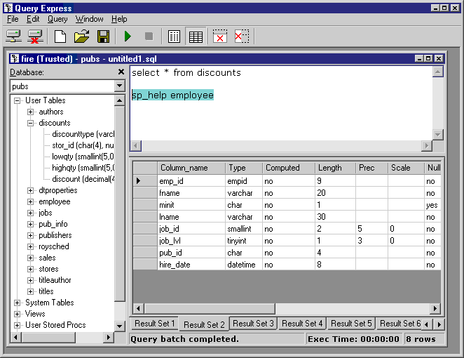

# Databasing Useful Tools

## Query Express
> Query Express is a simple Query Analyzer look-alike, but being small and free it can be run where the SQL Server client tools are not installed or licensed. This makes it especially useful as a query tool for MSDE and SQL Express. It also connects to Oracle and other OLE-DB compliant databases.

> Query Express requires no installation and is packaged as a single 100KB executable. This is more than 300 times smaller than SQL Server Management Studio

### Download Page
- [Query Express](http://www.albahari.com/queryexpress.aspx)

## LinqPad
- Instantly test any C#/F#/VB snippet or program
- Query databases in LINQ (or SQL) — SQL/Azure, Oracle, SQLite, Postgres & MySQL
- Enjoy rich output formatting, optional autocompletion and integrated debugging
- Script and automate in your favorite .NET language
- Super lightweight — single 20MB executable!
- Standard edition free, with no expiry

### Download 

[Linqpad](https://www.linqpad.net/)