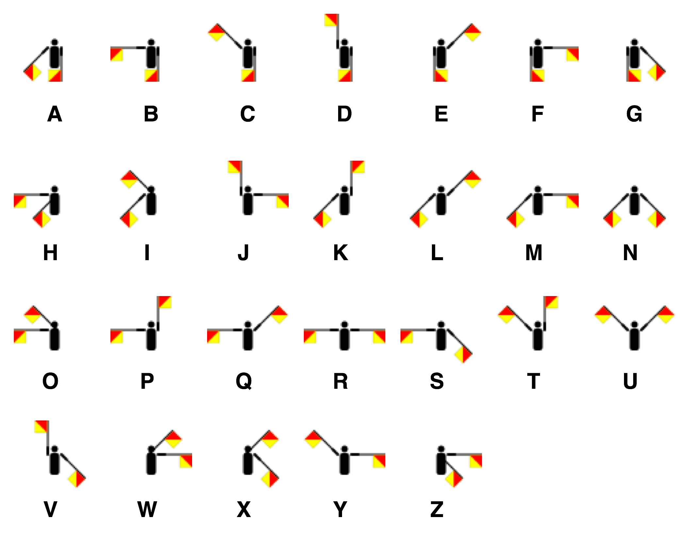

# Semaphore

  

> Definition : a system of sending messages by holding the arms or two flags or poles in certain positions according to an alphabetic code.

---

> Semaphore in Threading: The semaphore class lets you set a limit on the number of threads that have access to a critical section. The class is used to control access to a pool of resources. System.Threading.Semaphore is the namespace for Semaphore because it has all the methods and properties required to implement Semaphore.

- For using a semaphore in C#, you just need to instantiate an instance of a Semaphore object. It has minimum of two arguments −

|Constructor| Description|
|:---------:|:-----------|
|Semaphore(Int32,Int32)|Initializes a new instance of the Semaphore class, specifying the initial number of entries and the maximum number of concurrent entries.|
|Semaphore(Int32,Int32,String)|1 + optionally specifying the name of a system semaphore object.|
|Semaphore(Int32,Int32,String,Boolean)| 2+ specifying a variable that receives a value indicating whether a new system semaphore was created.|
