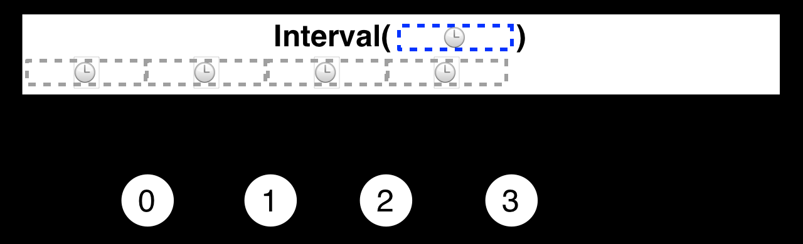

# Interval Operator

> create an Observable that emits a sequence of integers spaced by a given time interval.



- The Interval operator returns an Observable that emits an infinite sequence of ascending integers, with a constant interval of time of your choosing between emissions.

```{c#}
    public class IntervalInvoker<T>
    {
        private TimeSpan _waitFor;
        private Action<List<T>> _action;
        public List<T> List { get; set; }
        public IntervalInvoker(double seconds, Action<List<T>> action)
        {
            List = new List<T>();
            _waitFor = TimeSpan.FromSeconds(seconds);
            _action = action;
        }

        public void Invoke()
        {
            Observable.Interval(_waitFor)
                .Subscribe(i => {
                    if (List.Any())
                    {
                        _action.Invoke(List);
                    }
                    List = new List<T>();
                });
        }
    }
```