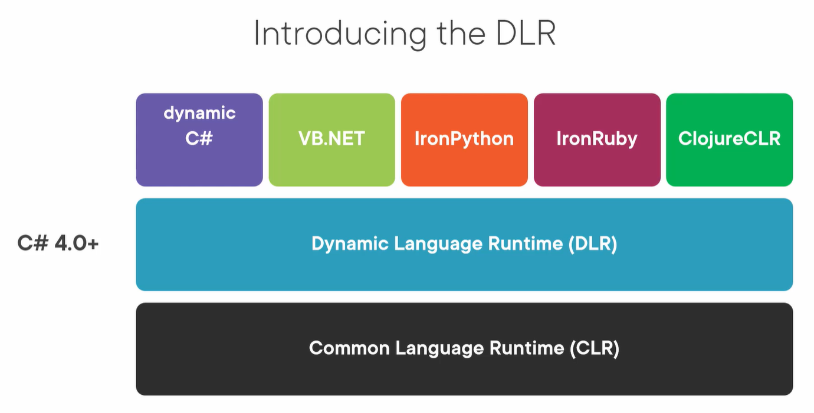

# Dynamic C#
> Dynamic C# : The __dynamic__ type is a __static__ type, but an object of type dynamic bypasses static type checking. In most cases, it functions like it has type object. The compiler assumes a dynamic element supports any operation. 

- Therefore, you don't have to determine whether the object gets its value from a COM API, from a dynamic language such as IronPython, from the HTML Document Object Model (DOM), from reflection, or from somewhere else in the program. However, if the code isn't valid, errors surface at __runtime__.

## Why Dynamic ??
- Compliments `normal` Statically typed C#
- When we don't now the object/data structure at compile time
- Where you do and compiler doesn't
- Improve Source code 
  - Simplify code / less clutter 
  - Improve overall readability / intent
  - Reduce the amount of code (Productivity)
- When we are working weakly typed data (Json, XML, Plain Text)
- COM Interop code 
- Interop with other languages (IronPy)

"It's like say to the compiler" => I know you don't know if you can do this or not now, but just trust me, I know that at runtime that everything will be fine :)

## Example Usage
- Replacing Reflection code 
- Simpler COM Interop
- Dynamic Json Processing
- XAML DataBinding
- Data Access code 
- Automated tests

## DLR Dynamic Language Runtime

> C# 4.0 + the DLR is added over the CLR Allowing the C# and VB.net and other language live over the DLR (IronPy, ClojureClR, IronRupy)



## DLR benefits 
- Simplify creation/porting of dynamic languages to .Net
- Enable dynamic behaviour in statically dynamic languages 
  - `dynamic` keyword in C#
- Enable library sharing between languages
- Enable object interoperability 
  - `IDynamicMetaObjectProvider`
  - `DynamicObject` class
  - `ExpandoObject` class
- Call site caching

## Static and Dynamic Binding

### Binding as Overall
> means slightly different things to different people, but at an abstract level we can think of binding as "Binding is the association of a Syntactic element (Such as a name of a method) with a logical program element"

### Static Binding
```{C#}
Calcualator c = new Calcualator();
c.Add(5);
## Compiler error will be exist as no Xyz func found
c.Xyz(3);
```
- `Add` method is a Static binding element = Binding occurs at the __compile__ time
- `Xyz` not a method inside the Calcualator so compiler knows that no such function. => Cannot build & execute program

### Dynamic Binding
```{C#}
dynamic c = new Calcualator();
c.Add(5);
c.Xyz(3);
```
- `Add` method is a dynamuc binding element = Binding occurs at the __runtime__ so no errors in compile time and runtime.
- `Xyz` not a method inside the Calcualator but compiler doesn't know that no such function. => Build Success, But will have a `runtime` error.

> Even with dynamic C#, type safety is still enforced, only this time it's at runtime 

## dynamic vs var
- Let's see the 3 examples to know the differences:

Ex1:
- Static (Compile time) type of d `dynamic`. 
- runtime will be `string`.
```{c#}
dynamic d = "Hi Ahmed";
```

Ex2:
- Static (Compile time) type of d `string`. 
- runtime will be `string`.
```{c#}
string d = "Hi Ahmed";
```

Ex3:
- Static (Compile time) type of d `string`. 
- runtime will be `string`.
```{c#}
var d = "Hi Ahmed";
```
> var = Compiler working out the type.

> dynamic = Runtime working out the type.


## Runtime method resolution

- the runtime choose the method based on type overload, the runtime knows that no `dynamic` as it resolves it, so if you have tow overloads one recieving `int` and the second recieving `dynamic` as shown in next example:

```{C#}

int i = 23;
PrintK(i);

dynamic d = 22;

PrintK(d);

static void PrintK(int i){
    WriteLine($"Print(int i) is printing {i}");
}

static void PrintK(dynamic i){
    WriteLine($"Print(dynamic i) is printing {i} with type = {i.GetType()}");
}


```

- in 2 cases the overload of PrintK(int i) will be called, runtime knows that in 2 cases are integer.


